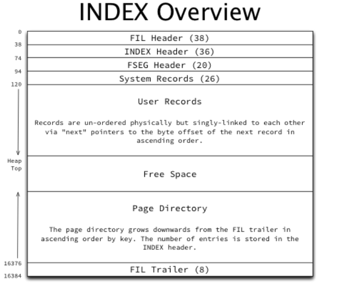
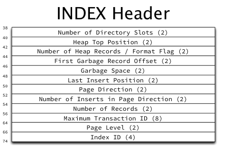
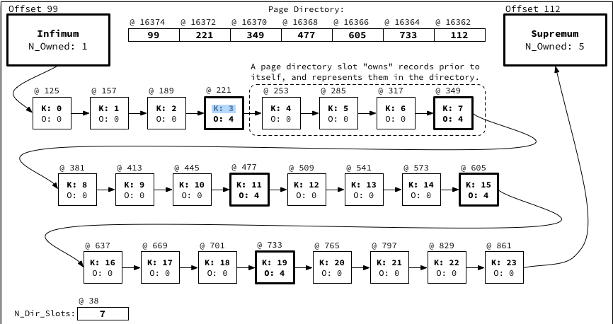

### MySQL(InnoDB) — "모든 페이지는 index page"




> index page의 실제 구조의 경우 정리된 공식 문서럴 찾기가 어려워 "[Jeremy Cole의 분석 글](https://blog.jcole.us/2013/01/07/the-physical-structure-of-innodb-index-pages/)"을 참고했다.

InnoDB는 PostgreSQL과 달리 **페이지 헤더가 두 겹**이다.

#### ① FIL_PAGE 헤더 — 모든 페이지 타입 공통(offset 0부터)

[fil0types.h](https://github.com/mysql/mysql-server/blob/06a5c1c99c377fc41b2eba1ea244e8b220bdc3c8/storage/innobase/include/fil0types.h#L43)
```c
// fil0types.h
constexpr uint32_t FIL_PAGE_SPACE_OR_CHKSUM = 0;   // 체크섬
constexpr uint32_t FIL_PAGE_OFFSET          = 4;   // 페이지 번호
constexpr uint32_t FIL_PAGE_PREV            = 8;   // 같은 레벨의 이전 페이지
constexpr uint32_t FIL_PAGE_NEXT            = 12;  // 같은 레벨의 다음 페이지
constexpr uint32_t FIL_PAGE_LSN             = 16;
constexpr uint32_t FIL_PAGE_TYPE            = 24;  // FIL_PAGE_INDEX 등
```

`FIL_PAGE_PREV`/`FIL_PAGE_NEXT`(형제 페이지 포인터)가 B-tree 전용 special space가 아니라 **모든 페이지가 공유하는 공통 헤더**에 있다는 게 특징이다.
PostgreSQL은 이 정보(`btpo_prev`/`btpo_next`)를 B-tree 전용 `BTPageOpaqueData`(special space)에 따로 두는데, InnoDB는 최상위 공통 헤더에 박아놨다
이는 기본적으로 테이블을 Index Organized Table의 형태로 가져가는 설계에서 비롯된 것으로 보인다.

#### ② PAGE_HEADER — 인덱스 페이지 전용(FIL_PAGE 헤더 바로 뒤)

[page0types.h](https://github.com/mysql/mysql-server/blob/06a5c1c99c377fc41b2eba1ea244e8b220bdc3c8/storage/innobase/include/page0types.h)
```c
// page0types.h
constexpr uint32_t PAGE_N_DIR_SLOTS = 0;   // page directory 슬롯 개수
constexpr uint32_t PAGE_HEAP_TOP    = 2;   // 레코드 힙의 첫 빈 공간
constexpr uint32_t PAGE_N_HEAP      = 4;   // 힙에 있는 레코드 개수
constexpr uint32_t PAGE_FREE        = 6;   // 삭제된 레코드들의 연결리스트 시작
constexpr uint32_t PAGE_GARBAGE     = 8;   // 삭제되었지만 회수 안 된 바이트 수
constexpr uint32_t PAGE_N_RECS      = 16;  // 실제 사용자 레코드 개수
constexpr uint32_t PAGE_LEVEL       = 26;  // B-tree 레벨(0 = leaf)
constexpr uint32_t PAGE_INDEX_ID    = 28;  // 이 페이지가 속한 인덱스 ID
```

`PAGE_LEVEL`도 PostgreSQL(`btpo_level`, special space)과 달리 이 공통 인덱스 페이지 헤더에 그냥 필드로 들어있다.

#### 레코드 배치 — 슬롯 배열이 아니라 연결리스트

가장 큰 차이가 여기다. PostgreSQL는 슬롯 배열(각 슬롯 = offset+length)로 레코드를 가리키는데, **InnoDB는 레코드끼리 키 순서로 연결된 단방향 연결리스트다.** 각 레코드 헤더에 "다음 레코드까지의 상대 오프셋"이 들어있고, `PAGE_N_DIR_SLOTS`로 표현되는 page directory는 이 연결리스트 전체를 순회하지 않고 이진 탐색을 하기 위한 **희소(sparse) 인덱스**일 뿐이다(몇 개 레코드마다 하나씩만 슬롯을 둠). 모든 페이지는 `infimum`/`supremum`이라는 sentinel 레코드로 시작/끝나 연결리스트의 경계를 표시한다.

[page0page.cc](https://github.com/mysql/mysql-server/blob/06a5c1c99c377fc41b2eba1ea244e8b220bdc3c8/storage/innobase/page/page0page.cc#L295-L302)
```cpp
// page0page.cc
/** The page infimum and supremum of an empty page in ROW_FORMAT=COMPACT */
static const byte infimum_supremum_compact[] = {
    /* the infimum record */
    0x01 /*n_owned=1*/, 0x00, 0x02 /* heap_no=0, REC_STATUS_INFIMUM */, 0x00,
    0x0d /* pointer to supremum */, 'i', 'n', 'f', 'i', 'm', 'u', 'm', 0,
    /* the supremum record */
    0x01 /*n_owned=1*/, 0x00, 0x0b /* heap_no=1, REC_STATUS_SUPREMUM */, 0x00,
    0x00 /* end of record list */, 's', 'u', 'p', 'r', 'e', 'm', 'u', 'm'};
};

/** The index page creation function.
@param[in,out]  block           a buffer block where the page is created
@param[in]      comp            nonzero=compact page format
@param[in]      page_type       page type
@return pointer to the page */
page_t *page_create_low(buf_block_t *block, ulint comp, page_type_t page_type) {
  page_t *page;

  static_assert(PAGE_BTR_IBUF_FREE_LIST + FLST_BASE_NODE_SIZE <= PAGE_DATA,
                "PAGE_BTR_IBUF_FREE_LIST + FLST_BASE_NODE_SIZE > PAGE_DATA");

  static_assert(PAGE_BTR_IBUF_FREE_LIST_NODE + FLST_NODE_SIZE <= PAGE_DATA,
                "PAGE_BTR_IBUF_FREE_LIST_NODE + FLST_NODE_SIZE > PAGE_DATA");

  buf_block_modify_clock_inc(block);

  page = buf_block_get_frame(block);

  ut_ad(page_type == FIL_PAGE_INDEX || page_type == FIL_PAGE_RTREE ||
        page_type == FIL_PAGE_SDI);

  fil_page_set_type(page, page_type);

  memset(page + PAGE_HEADER, 0, PAGE_HEADER_PRIV_END);
  page[PAGE_HEADER + PAGE_N_DIR_SLOTS + 1] = 2;
  page[PAGE_HEADER + PAGE_DIRECTION + 1] = PAGE_NO_DIRECTION;

  if (comp) {
    page[PAGE_HEADER + PAGE_N_HEAP] = 0x80; /*page_is_comp()*/
    page[PAGE_HEADER + PAGE_N_HEAP + 1] = PAGE_HEAP_NO_USER_LOW;
    page[PAGE_HEADER + PAGE_HEAP_TOP + 1] = PAGE_NEW_SUPREMUM_END;
    memcpy(page + PAGE_DATA, infimum_supremum_compact,
           sizeof infimum_supremum_compact);
    memset(page + PAGE_NEW_SUPREMUM_END, 0,
           UNIV_PAGE_SIZE - PAGE_DIR - PAGE_NEW_SUPREMUM_END);
    page[UNIV_PAGE_SIZE - PAGE_DIR - PAGE_DIR_SLOT_SIZE * 2 + 1] =
        PAGE_NEW_SUPREMUM;
    page[UNIV_PAGE_SIZE - PAGE_DIR - PAGE_DIR_SLOT_SIZE + 1] = PAGE_NEW_INFIMUM;
  } else {
    page[PAGE_HEADER + PAGE_N_HEAP + 1] = PAGE_HEAP_NO_USER_LOW;
    page[PAGE_HEADER + PAGE_HEAP_TOP + 1] = PAGE_OLD_SUPREMUM_END;
    memcpy(page + PAGE_DATA, infimum_supremum_redundant,
           sizeof infimum_supremum_redundant);
    memset(page + PAGE_OLD_SUPREMUM_END, 0,
           UNIV_PAGE_SIZE - PAGE_DIR - PAGE_OLD_SUPREMUM_END);
    page[UNIV_PAGE_SIZE - PAGE_DIR - PAGE_DIR_SLOT_SIZE * 2 + 1] =
        PAGE_OLD_SUPREMUM;
    page[UNIV_PAGE_SIZE - PAGE_DIR - PAGE_DIR_SLOT_SIZE + 1] = PAGE_OLD_INFIMUM;
  }

  return (page);
}
```

#### Page Directory — 데이터가 아니라 "sparse 포인터 배열"

> **용어 주의**: 여기서 말하는 "레코드 힙"(`PAGE_N_HEAP`/`PAGE_HEAP_TOP`, 페이지 한 장 안에서 레코드가 쌓이는 영역)은 PostgreSQL식 **heap table**(인덱스와 별개로 row 전체를 담는 저장 구조)과 전혀 다른 개념이다. 뒤의 "모든 페이지는 index" 절에서 말하는 "별도 heap 저장소는 없다"는 후자(heap table) 얘기다.

Jeremy Cole의 글도 page directory가 모든 레코드를 가리키는 게 아니라는 걸 명시한다.

> "The page directory contains a pointer to every 4-8 records, in addition to always containing an entry for infimum and supremum."

즉 directory slot은 데이터를 담는 그릇이 아니라, **페이지 끝에서부터 거꾸로 쌓이는 2바이트짜리 포인터**다. 슬롯 하나가 담는 건 "대표 레코드가 페이지 안 어디 있는지" 오프셋뿐이고, 실제 레코드 데이터(헤더+컬럼값)는 여기 없다 — 전부 `PAGE_DATA`부터 시작하는 레코드 힙 영역에, `next` 포인터로 연결된 채로 있다.

[page0page.h](https://github.com/mysql/mysql-server/blob/06a5c1c99c377fc41b2eba1ea244e8b220bdc3c8/storage/innobase/include/page0page.h#L60-L64)
```c
// page0page.h
/* Offset of the directory start down from the page end. We call the
slot with the highest file address directory start, as it points to
the first record in the list of records. */
constexpr uint32_t PAGE_DIR = FIL_PAGE_DATA_END;   // 페이지 끝에서부터 시작

/* We define a slot in the page directory as two bytes */
constexpr uint32_t PAGE_DIR_SLOT_SIZE = 2;         // 슬롯 하나 = 2바이트
```

```
페이지 앞쪽                                                    페이지 뒤쪽
+------------------+------------------------------+------------------+
|  PAGE_HEADER     |  레코드 힙 (실제 데이터, 전부 여기)  |  page directory |
|  (앞에서 시작)      |  infimum→A→B→C→...→supremum   |  (뒤에서 시작,     |
|                  |  ←(next로 연결된 리스트, 전체)     |   슬롯들이 거꾸로)  |
+------------------+------------------------------+------------------+
```

**슬롯은 레코드 개수만큼 있는 게 아니라, 4~8개마다 하나씩만 있다(sparse).** 레코드들을 작은 그룹으로 묶어서 그룹의 마지막(키 순서상 가장 큰) 레코드만 슬롯이 직접 가리킨다.

[page0page.h](https://github.com/mysql/mysql-server/blob/06a5c1c99c377fc41b2eba1ea244e8b220bdc3c8/storage/innobase/include/page0page.h#L73-L74)
```c
constexpr uint32_t PAGE_DIR_SLOT_MAX_N_OWNED = 8;
constexpr uint32_t PAGE_DIR_SLOT_MIN_N_OWNED = 4;
```

이 "그룹 대표" 레코드의 헤더에 있는 `n_owned` 필드가 **"내가 몇 번째 슬롯인지"가 아니라 "내가 몇 개의 레코드를 대표하는지"(개수)** 를 저장한다. [Efficiently traversing InnoDB B+Trees with the page directory](https://blog.jcole.us/2013/01/14/efficiently-traversing-innodb-btrees-with-the-page-directory/)(Jeremy Cole)가 정확히 이걸 설명한다.

> "Each entry in the page directory 'owns' the records between the previous entry in the directory, up to and including itself. The count of records 'owned' by each record is stored in the record header."

소스 코드 선언부도 같은 내용을 확인해준다.

[page0page.h](https://github.com/mysql/mysql-server/blob/06a5c1c99c377fc41b2eba1ea244e8b220bdc3c8/storage/innobase/include/page0page.h#L329-L334)
```c
// page0page.h
/** Gets the number of records owned by a directory slot.
 @return number of records */
static inline ulint page_dir_slot_get_n_owned(const page_dir_slot_t *slot);
```



- [참고](https://blog.jcole.us/2013/01/14/efficiently-traversing-innodb-btrees-with-the-page-directory/)

> **`A`는 도착점일 뿐 출발점이 아니다.** `next`가 한 방향(앞으로만)이라 `A`에서 거꾸로 되짚어갈 방법은 없다. `A`가 대표하는 5개(자신 포함)를 실제로 훑으려면, `A`가 아니라 **이전 슬롯(`slot[i-1]`)이 가리키는 `P`**에서 출발해서 `next`를 따라 `A`에 도달할 때까지 걸어가야 한다
> `P`는 directory에서 바로 얻어지는 정보라 별도 탐색이 필요 없다.
> infimum/supremum이 둘 다 `n_owned=1`인 이유도 이 그림으로 설명된다(supremum의 경우 터가 있는경우 1이 아닌 값을 가진다.)
> 이 둘은 항상 각자 전용 슬롯(가장 첫 슬롯/가장 마지막 슬롯)을 배정받고, 절대 다른 레코드와 그룹으로 묶이지 않아서 "자기 혼자만의 그룹"이기 때문이다.
> 삽입/삭제로 그룹 크기가 8을 넘거나 4 밑으로 떨어지면 슬롯을 분할/병합(`page_dir_split_slot` 등)해서 4~8 범위를 유지한다.

**PostgreSQL/jsDB의 슬롯 배열과 근본적으로 다른 지점이다.**

| | PostgreSQL/jsDB | InnoDB |
|---|---|---|
| 슬롯 개수 | 레코드 개수만큼(1:1, dense) | 레코드 개수의 1/4~1/8만(sparse) |
| 슬롯이 가리키는 것 | 레코드 각각 | 그룹 대표 레코드만 |
| 레코드 간 순서 유지 | 슬롯 배열 순서 자체 | 레코드끼리 `next`로 직접 연결 |
| "레코드 힙" 개념 | 없음(슬롯이 곧 목차) | 있음(directory와 물리적으로 분리) |

흥미로운 지점은, **PostgreSQL의 index(B-tree) page조차 이 sparse+연결리스트 조합을 안 쓴다는 것**이다. PostgreSQL은 heap page든 index page든 항상 `ItemId` 배열(레코드당 1개, dense)만 쓴다
- "heap/index 구분이 없다"는 InnoDB의 큰 그림(모든 페이지가 index)은 PostgreSQL의 index page 개념과 통하지만, 정작 그 안의 "레코드 힙 + 성긴 directory + 연결리스트" 구조는 InnoDB만의 독자적인 방식이다.

#### infimum/supremum 바이트 해부 — 왜 복사만 해도 동작하는가

`infimum`/`supremum`은 단순히 리스트의 head/tail *포인터*가 아니라, **항상 실존하는 더미(sentinel) 레코드** 자체다.
infimum(하한)은 페이지 안 어떤 키보다도 작은 "−∞", supremum(상한)은 어떤 키보다도 큰 "+∞" 역할을 한다.
그래서 탐색 알고리즘이 "여기가 페이지의 처음/끝인가?"를 매번 예외 처리할 필요 없이, 그냥 infimum부터 비교를 시작해서 supremum을 만나면 끝나는 식으로 균일하게 동작할 수 있다.

[page0page.cc 참고](https://github.com/mysql/mysql-server/blob/06a5c1c99c377fc41b2eba1ea244e8b220bdc3c8/storage/innobase/page/page0page.cc#L295-L302)
```c
0x01,             /* n_owned=1 */
0x00, 0x02,       /* heap_no=0, status=2(INFIMUM) */
0x00, 0x0d,       /* next = 13바이트 뒤(=supremum 시작 위치) */
'i','n','f','i','m','u','m', 0
```

**위치별로 의미가 다르다.**
- **byte[0~4] (5바이트) = 레코드 헤더/메타데이터**: n_owned(page directory가 몇 개를 대표하는지), heap_no+status, next(다음 레코드까지의 오프셋). "인덱스"(B-tree 인덱스가 아니라 일반적 의미의 색인 정보)에 해당한다.
- **byte[5~] = 데이터 페이로드**: `"infimum\0"`/`"supremum"` 문자열. 이건 길이를 맞추려고 넣은 게 아니라, 실제 레코드였다면 컬럼 값이 들어갈 자리에 **식별 가능한 값을 넣은 것**이다 — hex dump로 페이지를 봤을 때 바로 알아볼 수 있고, 압축 시 무결성 검증(`memcmp`)의 canary 값으로도 쓰인다. 레코드 길이(13바이트)는 이 문자열 길이의 **결과**일 뿐, 처음부터 13바이트에 맞추려고 설계된 게 아니다.

**"4~5번째 바이트(next 필드)를 읽어서 다음 레코드 위치를 계산한다"는 게 실제 구현이다.**

[rem0rec.ic](https://github.com/mysql/mysql-server/blob/06a5c1c99c377fc41b2eba1ea244e8b220bdc3c8/storage/innobase/include/rem0rec.ic#L124-L152)
```cpp
// rem0rec.ic — rec_get_next_ptr_const
static inline const rec_t *rec_get_next_ptr_const(const rec_t *rec, ulint comp) {
  const auto field_value = mach_read_from_2(rec - REC_NEXT);   // 헤더의 next 필드 2바이트 읽기
  if (field_value == 0) return (nullptr);

  if (comp) {
    // COMPACT 포맷: field_value는 "현재 레코드 기준" 부호 있는 상대 오프셋
    return ((byte *)ut_align_down(rec, UNIV_PAGE_SIZE) +
            ut_align_offset(rec + field_value, UNIV_PAGE_SIZE));
  } else {
    // REDUNDANT 포맷: field_value는 페이지 시작 기준 절대 오프셋
    return ((byte *)ut_align_down(rec, UNIV_PAGE_SIZE) + field_value);
  }
}
```

핵심 포인트 두 가지:
1. **페이지는 그냥 평평한 바이트 배열**이고, "연결리스트"는 진짜 메모리 포인터가 아니라 **레코드 헤더에 박힌 상대 오프셋**으로 흉내낸 것이다. 디스크에 썼다가 나중에 다시 읽으면 실제 메모리 주소는 매번 달라지니, 영속화되는 자료구조는 이렇게 오프셋(배열 인덱스에 가까운 개념) 기반으로 짤 수밖에 없다.
2. `rec` 포인터는 관례적으로 **헤더가 아니라 데이터 시작점**을 가리킨다. 그래서 헤더 필드는 전부 `rec - REC_NEXT`처럼 **음수 방향**으로 접근한다.
3. infimum의 `next` 값(0x0d=13)이 상수로 박혀있을 수 있는 이유도 여기서 나온다 — COMPACT 포맷의 next는 "현재 레코드 기준" 상대 오프셋이라, infimum이 페이지의 어느 절대 위치에 있든 상관없이 "나로부터 13바이트 뒤"라는 값은 항상 참이기 때문이다.

#### "모든 페이지는 index" — heap/index 구분이 아예 없음

Jeremy Cole의 글이 이 부분을 InnoDB 이해의 핵심 전제로 못박는다.

> "Before diving into physical structures, it's critical to understand that in InnoDB, everything is an index."
>
> "Secondary keys are stored in an identical index structure, but they are keyed on the KEY fields, and the primary key value (PKV) is attached to that key."

- **Clustered index(PK 기준 B-tree)**: 리프 페이지에 **row 전체 데이터**가 들어있다 — 이게 사실상 "테이블 데이터"이고, 별도의 heap 저장소는 없다.
- **Secondary index**: 리프 페이지에 (인덱스 컬럼 값 + PK 값)만 들어있다.
- **둘 다 물리적으로 완전히 같은 페이지 포맷**(FIL_PAGE + PAGE_HEADER + infimum/supremum + 레코드 연결리스트 + page directory)을 쓴다. `fil0fil.h`의 `FIL_PAGE_TYPE`에도 `FIL_PAGE_INDEX` 하나뿐이지 "heap page" 타입이 따로 없다.

PostgreSQL은 heap page(`HeapTupleHeaderData`)와 index page(`IndexTupleData`)가 **물리적으로 다른 포맷**인데, InnoDB는 이 구분 자체가 없다.

#### MVCC — hint bit이 아니라 숨겨진 컬럼 + undo log

PostgreSQL은 튜플 헤더에 `xmin`/`xmax` + hint bit를 직접 넣는데, InnoDB는 클러스터드 인덱스 레코드 자체에 **숨겨진 시스템 컬럼**(`DB_TRX_ID` 6바이트, `DB_ROLL_PTR` 7바이트)을 심어두고, 이걸로 언두 로그(undo log)를 따라가며 이전 버전을 재구성한다. "커밋 여부를 캐싱하는 hint bit" 개념 자체가 없는 대신, 언두 로그 체인을 타는 비용이 있다 — PostgreSQL이 겪은 "hint bit 갱신과 페이지 write-out이 충돌"([postgres-content-lock.md](../PostgreSQL/content-lock.md) 참고) 같은 문제를 InnoDB가 애초에 겪지 않는 이유 중 하나로 보인다.

