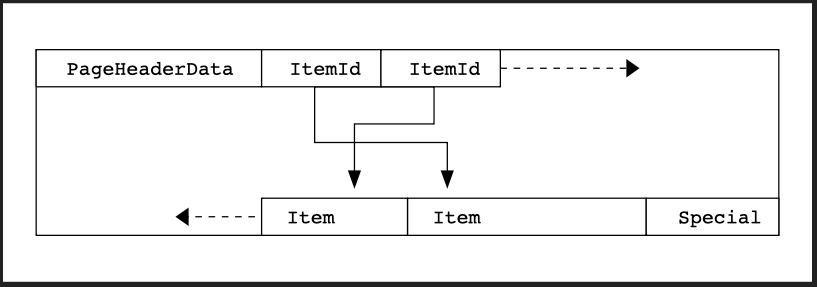

## Page & Tuple Layout

> 하나의 페이지 안에서 실제 row 데이터가 물리적으로 어떻게 배치되는지에 대 한 내용이다.

### Slotted Page

PostgreSQL 공식 문서에 정리되어 있는 레이아웃이다: [Database Page Layout](https://www.postgresql.org/docs/current/storage-page-layout.html).




| | PostgreSQL |
|---|--|
| 페이지 헤더 | `PageHeaderData`(24바이트): `pd_lsn`, `pd_checksum`, `pd_flags`, `pd_lower`, `pd_upper`, `pd_special`, `pd_pagesize_version`, `pd_prune_xid` |
| 슬롯 배열 | `ItemIdData`(line pointer) 배열, `pd_linp[]` |
| 레코드 |  튜플(`HeapTupleHeaderData` + 컬럼 데이터) 또는 인덱스 튜플(`IndexTupleData` + 키 값) |
| 빈 공간 정리 | VACUUM / `PageRepairFragmentation` |

### Page Header vs Tuple Header

**페이지 헤더(`PageHeaderData`)는 페이지당 딱 1개**, **튜플 헤더(`HeapTupleHeaderData`)는 그 페이지에 저장된 row 개수만큼 N개** 존재한다. 완전히 다른 레벨의 메타데이터다.
- PostgreSQL의 경우 튜플 헤더에 xmin, xmax 등의 트랜젝션 관련 정보를 캐싱의 용도로 저장한다. 

[bufpage.h (PG16)](https://github.com/postgres/postgres/blob/9a0cd8e73f52307162f0c81e2d6e52c79f5592c3/src/include/storage/bufpage.h#L155)
```c
// bufpage.h — 페이지 전체 메타데이터 (1개)
typedef struct PageHeaderData
{
	PageXLogRecPtr pd_lsn;      // 이 페이지 마지막 변경의 WAL 위치
	uint16      pd_checksum;
	uint16      pd_flags;
	LocationIndex pd_lower;     // 빈 공간 시작 지점(=슬롯 배열 끝)
	LocationIndex pd_upper;     // 빈 공간 끝 지점(=데이터 시작)
	LocationIndex pd_special;   // special space 시작 지점
	uint16      pd_pagesize_version;
	TransactionId pd_prune_xid;
	ItemIdData  pd_linp[FLEXIBLE_ARRAY_MEMBER];  // 슬롯 배열
} PageHeaderData;
```

[htup_details.h (PG16)](https://github.com/postgres/postgres/blob/9a0cd8e73f52307162f0c81e2d6e52c79f5592c3/src/include/access/htup_details.h#L153)
```c
// htup_details.h — row(튜플) 하나당 메타데이터 (N개)
struct HeapTupleHeaderData
{
	union {
		HeapTupleFields t_heap;   // t_xmin, t_xmax, t_cid
		DatumTupleFields t_datum;
	} t_choice;

	ItemPointerData t_ctid;       // 이 튜플(혹은 최신 버전)의 TID
	uint16      t_infomask2;      // 컬럼 개수 + 플래그
	uint16      t_infomask;       // hint bit 등 각종 플래그 비트 — 아래 참고
	uint8       t_hoff;           // 헤더 크기(+ null bitmap 포함)
	bits8       t_bits[FLEXIBLE_ARRAY_MEMBER];  // NULL 비트맵
	/* 이 뒤로 실제 컬럼 데이터 */
};
```

### Hint Bit — MVCC 가시성 캐시

PostgreSQL은 MVCC를 쓰기 때문에 각 튜플이 `t_xmin`(이 row를 만든 트랜잭션)과 `t_xmax`(지운/갱신한 트랜잭션)를 갖는다.
어떤 row가 지금 보여도 되는지 판단하려면 "그 트랜잭션이 커밋됐는지"를 알아야 하는데, 이걸 매번 커밋 로그(`pg_xact`/CLOG)에서 조회하면 비용이 든다.

그래서 한 번 조회한 결과를 튜플 헤더의 `t_infomask` 비트에 **캐싱**해둔다.

[htup_details.h (PG16)](https://github.com/postgres/postgres/blob/9a0cd8e73f52307162f0c81e2d6e52c79f5592c3/src/include/access/htup_details.h#L204-L208)
```c
// htup_details.h:204-208
#define HEAP_XMIN_COMMITTED   0x0100  /* t_xmin committed */
#define HEAP_XMIN_INVALID     0x0200  /* t_xmin invalid/aborted */
#define HEAP_XMIN_FROZEN      (HEAP_XMIN_COMMITTED|HEAP_XMIN_INVALID)
#define HEAP_XMAX_COMMITTED   0x0400  /* t_xmax committed */
#define HEAP_XMAX_INVALID     0x0800  /* t_xmax invalid/aborted */
```

다음에 같은 튜플을 읽는 백엔드는 CLOG를 다시 뒤질 필요 없이 이 비트만 보면 된다.

**"hint"라고 부르는 이유**: 이 비트를 잃어버려도(디스크 반영 전에 크래시 나도) 데이터 정합성엔 문제가 없다 — 다음에 읽는 쪽이 CLOG 조회를 다시 해서 비트를 재설정하면 그만이다. 그래서 WAL 로깅도 필요 없다 (`MarkBufferDirtyHint()`의 주석: "The caller does not write WAL"). 대량 INSERT/COPY 직후 첫 SELECT를 돌리면 갑자기 디스크 쓰기가 늘어나는 PostgreSQL의 유명한 현상이, 바로 이 hint bit를 그때 처음 세팅하면서 페이지들이 dirty로 표시되기 때문이다.

**Content lock과의 연결**: hint bit 갱신은 원래(PG16까지) 아주 약한 락 요구사항만 있었는데("share든 exclusive든 상관없다"), 이게 buffer flush 도중 페이지가 바뀔 수 있다는 문제로 이어져서 체크섬 활성화 시 페이지 복사가 필요했다. PostgreSQL 19에서 도입된 `SHARE_EXCLUSIVE` content lock 모드가 바로 이 문제를 해결한다. 자세한 내용은 [postgres-content-lock.md](../buffer-pool/postgres-content-lock.md) 참고.

### Heap Page vs Index Page — 같은 틀, 다른 내용물

PostgreSQL은 테이블(heap)과 인덱스(B-tree 등) 모두 **같은 `PageHeaderData` + slotted 구조**를 쓴다. 다른 건 슬롯이 가리키는 내용물과 special space다.

| | Heap(table) page | Index(B-tree) page |
|---|---|---|
| 슬롯이 가리키는 데이터 | `HeapTupleHeaderData`(xmin/xmax/hint bit) + 컬럼 값 전체 | `IndexTupleData` — 키 값 + 힙 튜플 TID(`t_tid`)만, MVCC 정보 없음 |
| Special space | 보통 안 씀 | `BTPageOpaqueData`: 왼쪽/오른쪽 형제 블록(`btpo_prev`/`btpo_next`), 트리 레벨(`btpo_level`), leaf/root/deleted 등 플래그(`btpo_flags`) |

[itup.h (PG16)](https://github.com/postgres/postgres/blob/9a0cd8e73f52307162f0c81e2d6e52c79f5592c3/src/include/access/itup.h#L35), [nbtree.h (PG16)](https://github.com/postgres/postgres/blob/9a0cd8e73f52307162f0c81e2d6e52c79f5592c3/src/include/access/nbtree.h#L62-L70)
```c
// itup.h — 인덱스 튜플은 MVCC 필드가 아예 없다
typedef struct IndexTupleData
{
	ItemPointerData t_tid;   // 힙 튜플을 가리키는 포인터
	unsigned short  t_info;  // has-null/var-width 플래그 + 튜플 크기
} IndexTupleData;

// nbtree.h — B-tree 페이지의 special space
typedef struct BTPageOpaqueData
{
	BlockNumber btpo_prev;
	BlockNumber btpo_next;
	uint32      btpo_level;
	uint16      btpo_flags;
	BTCycleId   btpo_cycleid;
} BTPageOpaqueData;
```