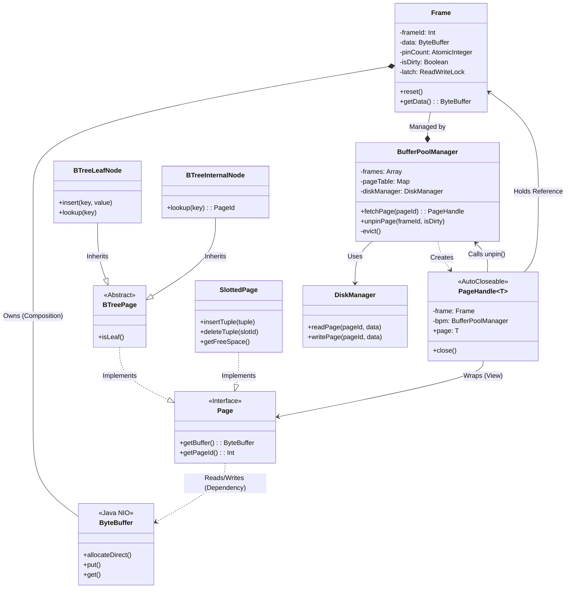

```mermaid

classDiagram
    class ByteBuffer {
        <<Java NIO>>
        +allocateDirect()
        +put()
        +get()
    }
    
    class DiskManager {
        +readPage(pageId, data)
        +writePage(pageId, data)
    }
    
    class Frame {
        -frameId: Int
        -data: ByteBuffer
        -pinCount: AtomicInteger
        -isDirty: Boolean
        -latch: ReadWriteLock
        +reset()
        +getData(): ByteBuffer
    }
    
    %% 2. 관리자 계층
    class BufferPoolManager {
        -frames: Array<Frame>
        -pageTable: Map<Int, Int>
        -diskManager: DiskManager
        +fetchPage<T>(pageId): PageHandle<T>
        +unpinPage(frameId, isDirty)
        -evict()
    }
    
    %% 3. 인터페이스 및 핸들 계층
    class PageHandle~T~ {
        <<AutoCloseable>>
        -frame: Frame
        -bpm: BufferPoolManager
        +page: T
        +close()
    }
    
    class Page {
        <<Interface>>
        +getBuffer(): ByteBuffer
        +getPageId(): Int
    }
    
    %% 4. 논리적 구현체 계층 (데이터 해석)
    class SlottedPage {
        +insertTuple(tuple)
        +deleteTuple(slotId)
        +getFreeSpace()
    }
    
    class BTreePage {
        <<Abstract>>
        +isLeaf()
    }
    
    class BTreeLeafNode {
        +insert(key, value)
        +lookup(key)
    }
    
    class BTreeInternalNode {
        +lookup(key): PageId
    }
    
    %% 관계 정의
    Frame *-- ByteBuffer : Owns (Composition)
    Frame --* BufferPoolManager : Managed by
    BufferPoolManager --> DiskManager : Uses
    BufferPoolManager ..> PageHandle : Creates
    
    PageHandle --> Frame : Holds Reference
    PageHandle --> BufferPoolManager : Calls unpin()
    PageHandle --> Page : Wraps (View)
    
    SlottedPage ..|> Page : Implements
    BTreePage ..|> Page : Implements
    BTreeLeafNode --|> BTreePage : Inherits
    BTreeInternalNode --|> BTreePage : Inherits
    
    Page ..> ByteBuffer : Reads/Writes (Dependency)
```
