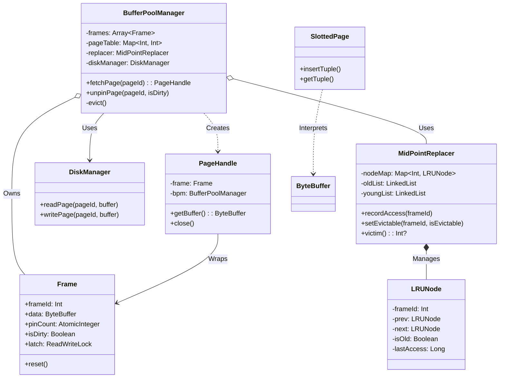

```mermaid

classDiagram
    %% 1. 정책 계층 (Policy Layer)
    class LRUNode {
        -frameId: Int
        -prev: LRUNode
        -next: LRUNode
        -isOld: Boolean
        -lastAccess: Long
    }

    class MidPointReplacer {
        -nodeMap: Map~Int, LRUNode~
        -oldList: LinkedList
        -youngList: LinkedList
        +recordAccess(frameId)
        +setEvictable(frameId, isEvictable)
        +victim(): Int?
    }

    %% 2. 자원 계층 (Resource Layer)
    class Frame {
        +frameId: Int
        +data: ByteBuffer
        +pinCount: AtomicInteger
        +isDirty: Boolean
        +latch: ReadWriteLock
        +reset()
    }

    class DiskManager {
        +readPage(pageId, buffer)
        +writePage(pageId, buffer)
    }

    %% 3. 관리 계층 (Management Layer)
    class BufferPoolManager {
        -frames: Array~Frame~
        -pageTable: Map~Int, Int~
        -replacer: MidPointReplacer
        -diskManager: DiskManager
        +fetchPage(pageId): PageHandle
        +unpinPage(pageId, isDirty)
        -evict()
    }

    %% 4. 인터페이스 계층 (Access Layer)
    class PageHandle {
        -frame: Frame
        -bpm: BufferPoolManager
        +getBuffer(): ByteBuffer
        +close()
    }

    %% 5. 논리적 뷰 (View Layer)
    class SlottedPage {
        +insertTuple()
        +getTuple()
    }

    %% 관계
    MidPointReplacer *-- LRUNode : Manages
    BufferPoolManager o-- Frame : Owns
    BufferPoolManager o-- MidPointReplacer : Uses
    BufferPoolManager --> DiskManager : Uses
    BufferPoolManager ..> PageHandle : Creates
    PageHandle --> Frame : Wraps
    SlottedPage ..> ByteBuffer : Interprets
```
